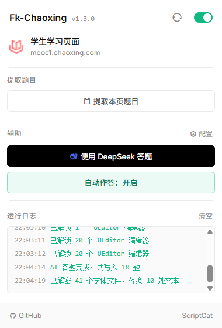

# Fk-Chaoxing 学习通助手 - Chrome 插件

Chrome 扩展，为超星学习通提供一键复制、字体解密、AI 自动答题等能力。基于 Manifest V3，全部逻辑在内容脚本中运行，零后端依赖。

好好学习天天向上！本插件仅供学习交流，使用者所产生的一切后果由使用者自行承担，与开发者无关。

<p align="center">
  
</p>

## 功能特性

- **解除限制**：解除复制/粘贴禁用、富文本编辑器限制、字体加密混淆
- **自动作答**：支持接入 OpenAI 兼容 API，自动识别并**写入**超星单选题、多选题、填空题、简答题，解放双手
- **多模型配置**：支持保存多个 AI 模型，可快速切换并执行连接测试
- **一键提取**：自动收集作业、考试、章节页面的题目

## 技术栈

- Manifest V3
- ES Module
- Shadow DOM 隔离样式
- MutationObserver + postMessage 跨 iframe 通信
- Chrome `storage.local` 本地配置持久化
- Chrome `permissions` + `optional_host_permissions` 动态申请 AI 接口域名权限
- OpenAI 兼容 Chat Completions API

## 项目结构

```
Fk-Chaoxing-Extension/
├── manifest.json              # 扩展权限、内容脚本与可选 Host 权限声明
├── background.js              # 后台 Service Worker
├── popup.html                 # 弹窗 UI 结构
├── popup.css                  # 弹窗样式
├── popup.js                   # 弹窗控制器
├── content-message-handler.js # 统一消息路由
├── content.js                 # 内容脚本入口
├── injected.js                # 注入页面上下文
├── modules/
│   ├── logger.js              # 全局日志
│   ├── ui/                    # 可复用组件
│   │   ├── Modal.js
│   │   └── Toast.js
│   ├── extractors/            # 题目提取器
│   │   ├── HomeworkExtractor.js
│   │   └── ExamExtractor.js
│   ├── services/              # 业务聚合
│   │   └── QuestionCollector.js
│   ├── ai-answer/             # AI 答题子系统
│   │   ├── api.js
│   │   ├── core.js
│   │   ├── index.js
│   │   ├── ui.js
│   │   └── notify.css
│   ├── PasteEnabler.js        # 破解粘贴限制
│   ├── CopyEnabler.js         # 字体解密
│   └── UEditorUnlock.js       # 富文本编辑器解锁
└── assets/
    ├── TyprMd5.js
    └── table.json
```


## 更新日志

见 [CHANGELOG.md](CHANGELOG.md)

## 快速开始

### 一、安装插件

1. 下载\克隆本仓库代码到本地
2. 打开 Chrome 浏览器，访问 `chrome://extensions/`
3. 开启右上角的"开发者模式"
4. 点击"加载已解压的扩展程序"
5. 选择本项目文件夹，点击"选择文件夹"
6. 插件图标将出现在浏览器工具栏


### 二、配置 AI 模型

首次使用 AI 答题功能前，需要先配置 AI 模型。

#### 步骤 1：打开插件配置

1. 点击浏览器工具栏上的插件图标
2. 在弹出的面板中，点击"配置模型"按钮

#### 步骤 2：填写 AI 配置

在弹出的配置窗口中填写以下信息：

| 配置项 | 说明 | 示例值 |
|--------|------|--------|
| **显示名称** | 给这个配置取个名字 | 答题助手 |
| **API 地址** | AI 服务的 base URL | `https://api.openai.com/v1` |
| **API Key** | 你的 API 密钥 | `sk-xxxxxxxxxxxxxxxx` |
| **模型 ID** | 要使用的模型名称 | `model-id` |
| **请求路径** | 通常保持默认 | `/chat/completions` |
| **温度系数** | 控制输出随机性，0-2之间 | `0.3` |

#### 步骤 3：保存并测试

1. 点击"保存"按钮
2. 插件会自动测试连接，确保配置正确
3. 如果测试通过，配置将被保存

#### 步骤 4：多模型管理（可选）

- **新增模型**：点击"新建模型"按钮，重复上述步骤
- **切换模型**：在弹出面板的下拉框中选择当前要使用的模型
- **删除模型**：选中模型后点击"删除"按钮


### 三、使用 AI 答题

#### 方式一：开启答题助手：自动作答 功能

1. 打开超星学习通作业/考试/章节页面
2. 等待页面题目加载完成
3. 点击插件图标打开弹窗
4. 点击"使用 AI 答题"按钮
5. 插件会自动：
   - 扫描页面所有题目
   - 调用 AI 分析并生成答案
   - 如果开启了"自动作答"，自动填写答案
   - 在通知面板显示答题进度和结果

#### 方式二：先提取再答题
1. 在超星页面，点击插件弹窗的"自动获取题目"按钮
2. 插件会收集所有题目并显示预览
3. 确认无误后点击"使用 AI 答题"按钮


### 四、提取题目

如果你只想收集题目（比如复制到其他地方），可以使用提取功能。

#### 步骤：

1. 打开超星页面
2. 点击插件图标
3. 点击"自动获取题目"按钮
4. 插件会：
   - 扫描页面所有题目
   - 自动复制到剪贴板
   - 显示预览弹窗
   - 插件图标右上角显示题目数量徽章


## 支持的页面类型

目前插件完整或部分支持以下超星页面：

| 页面类型 | URL 特征 | 支持状态 |
|----------|----------|----------|
| 章节学习 | `/mycourse/studentstudy` | 完全支持 |
| 作业作答（旧版） | `/work/doHomeWorkNew` | 完全支持 |
| 作业作答（新版） | `/mooc-ans/mooc2/work/dowork` | 完全支持 |
| 考试页面 | `/exam-ans/mooc2/exam/preview` | 完全支持 |
| 知识点 | `/knowledge/cards` | 完全支持 |

**注意**：如果你的作业页面显示"写入 0 题"，可能是因为该页面使用了新的 DOM 结构，请将相关页面 HTML 片段提供给开发者以便适配。

欢迎提交 Issue 和 PR！如果你发现新的超星页面结构不被支持，请提供相关 HTML 片段以便适配。

