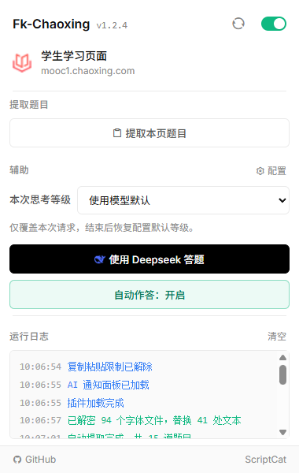

# Fk-Chaoxing 学习通助手 - Chrome 插件

Chrome 扩展，为超星学习通提供一键复制、字体解密、AI 自动答题等能力。基于 Manifest V3，全部逻辑在内容脚本中运行，零后端依赖。

好好学习天天向上！本插件仅供学习交流，使用者所产生的一切后果由使用者自行承担，与开发者无关。

<p align="center">
  
</p>

## 功能特性

- **解除限制**：解除复制/粘贴禁用、富文本编辑器限制、字体加密混淆
- **自动作答**：支持接入 OpenAI 兼容 API，自动识别并**写入**超星单选题、多选题、填空题、简答题、排序题和连线题，解放双手
- **多模型配置**：支持保存多个 AI 模型，可快速切换并执行连接测试
- **一键提取**：自动收集作业、考试、章节页面的题目

## 技术栈

- Manifest V3
- ES Module
- Shadow DOM 隔离样式
- MutationObserver + postMessage 跨 iframe 通信
- Chrome `storage.local` 本地配置持久化
- Chrome `permissions` + `optional_host_permissions` 动态申请 AI 接口域名权限
- OpenAI 兼容 Chat Completions / Responses API

## 项目结构

```
Fk-Chaoxing-Extension/
├── manifest.json              # 扩展权限、内容脚本与可选 Host 权限声明
├── background.js              # 后台 Service Worker
├── popup.html                 # 弹窗 UI 结构
├── popup.css                  # 弹窗样式
├── popup.js                   # 弹窗控制器
├── content-message-handler.js # 统一消息路由
├── content.js                 # 内容脚本入口
├── injected.js                # 注入页面上下文
├── modules/
│   ├── logger.js              # 全局日志
│   ├── ui/                    # 可复用组件
│   │   ├── Modal.js
│   │   └── Toast.js
│   ├── extractors/            # 题目提取器
│   │   ├── HomeworkExtractor.js
│   │   └── ExamExtractor.js
│   ├── services/              # 业务聚合
│   │   └── QuestionCollector.js
│   ├── ai-answer/             # AI 答题子系统
│   │   ├── api.js
│   │   ├── core.js
│   │   ├── index.js
│   │   ├── ui.js
│   │   └── notify.css
│   ├── PasteEnabler.js        # 破解粘贴限制
│   ├── CopyEnabler.js         # 字体解密
│   └── UEditorUnlock.js       # 富文本编辑器解锁
└── assets/
    ├── TyprMd5.js
    └── table.json
```


## 更新日志

见 [CHANGELOG.md](CHANGELOG.md)

## 快速开始

### 一、安装插件

1. 下载\克隆本仓库代码到本地
2. 打开 Chrome 浏览器，访问 `chrome://extensions/`
3. 开启右上角的"开发者模式"
4. 点击"加载已解压的扩展程序"
5. 选择本项目文件夹，点击"选择文件夹"
6. 插件图标将出现在浏览器工具栏


### 二、配置 AI 模型

首次使用 AI 答题功能前，需要先配置 AI 模型。

#### 步骤 1：打开插件配置

1. 点击浏览器工具栏上的插件图标
2. 在弹出的面板中点击“配置”，进入总体设置，再打开“模型管理”并点击“添加”

#### 步骤 2：填写 AI 配置

在模型编辑页填写以下信息：

| 配置项 | 说明 | 示例值 |
|--------|------|--------|
| **显示名称** | 给这个配置取个名字 | 答题助手 |
| **API 地址** | AI 服务的 base URL | `https://api.openai.com/v1` |
| **API Key** | 你的 API 密钥 | `sk-xxxxxxxxxxxxxxxx` |
| **模型 ID** | 要使用的模型名称 | `model-id` |
| **API 类型** | 每个模型配置独立选择协议 | `Chat Completions` / `Responses` |
| **请求路径** | 随 API 类型切换标准路径，自定义路径保留 | `/chat/completions` / `/responses` |
| **默认思考等级** | 使用模型默认、不思考、Low、Medium、High、XHigh、Max | `High` |
| **温度系数** | 0–2，可留空；Chat Completions 默认 `0.3`，Responses 默认留空；显式指定思考等级时禁用并省略 | `0.3` |

“使用模型默认”不发送思考参数；“不思考”发送 `none`。其余等级发送对应的小写值，Max 不会转换成 XHigh。模型或服务商不支持所选等级时会显示错误，请手动调整。旧配置继续使用 Chat Completions 和模型默认思考等级。

主面板的“本次思考等级”可以临时覆盖配置默认值。重新打开面板、切换模型或本次请求结束后会恢复默认；本次请求启动后，切换模型不会改变已发起的请求。

Responses 使用非流式请求（`store: false`），提取最终答案文本后沿用原有答案展示与填写流程，不展示推理过程。

#### 步骤 3：保存与测试

1. 点击“保存”即可保存有效配置，无需保持网络连接
2. 需要检查连接时，单独点击“测试连接”；测试会发送“仅回复 OK”并可能产生费用
3. 首次测试或使用新 API 地址答题时，浏览器会请求对应域名权限

#### 步骤 4：多模型管理（可选）

- **新增模型**：在“模型管理”点击“添加”，填完后保存
- **切换模型**：在模型列表点击“使用”，页面悬浮面板仍可切换当前模型
- **编辑或删除模型**：在模型列表打开编辑页后操作；离开未保存的编辑页会提示确认

#### 大题库答题设置

在弹窗“配置 → 总体设置”中设置每片题目数（1–100）、最大并发数（1–8）和失败重试次数（0–5）。默认每片 50 题、最多并发 4 片、每片最多额外重试 2 次；最大并发数设为 1 即逐片排队。设置对所有模型生效，答题任务开始后固定本次参数。

每片返回后立即展示答案，开启自动作答时按片串行填写；可恢复的网络或答案格式错误只重试失败片。重试耗尽后显示失败题号范围，其他片继续处理。答题任务启动后可以关闭弹窗，在试卷页面的悬浮面板查看进度与结果；不会自动保存或提交试卷。


### 三、使用 AI 答题

#### 方式一：开启答题助手：自动作答 功能

1. 打开超星学习通作业/考试/章节页面
2. 等待页面题目加载完成
3. 点击插件图标打开弹窗
4. 点击"使用 AI 答题"按钮
5. 插件会自动：
   - 扫描页面所有题目
   - 调用 AI 分析并生成答案
   - 如果开启了"自动作答"，自动填写答案
   - 在通知面板显示答题进度和结果

#### 方式二：先提取再答题
1. 在超星页面，点击插件弹窗的"自动获取题目"按钮
2. 插件会收集所有题目并显示预览
3. 确认无误后点击"使用 AI 答题"按钮


### 四、提取题目

如果你只想收集题目（比如复制到其他地方），可以使用提取功能。

#### 步骤：

1. 打开超星页面
2. 点击插件图标
3. 点击"自动获取题目"按钮
4. 插件会：
   - 扫描页面所有题目
   - 自动复制到剪贴板
   - 显示预览弹窗
   - 插件图标右上角显示题目数量徽章


## 支持的页面类型

目前插件完整或部分支持以下超星页面：

| 页面类型 | URL 特征 | 支持状态 |
|----------|----------|----------|
| 章节学习 | `/mycourse/studentstudy` | 完全支持 |
| 作业作答（旧版） | `/work/doHomeWorkNew` | 完全支持 |
| 作业作答（新版） | `/mooc-ans/mooc2/work/dowork` | 完全支持 |
| 考试页面 | `/exam-ans/mooc2/exam/preview` | 完全支持 |
| 知识点 | `/knowledge/cards` | 完全支持 |

**注意**：如果你的作业页面显示"写入 0 题"，可能是因为该页面使用了新的 DOM 结构，请将相关页面 HTML 片段提供给开发者以便适配。

欢迎提交 Issue 和 PR！如果你发现新的超星页面结构不被支持，请提供相关 HTML 片段以便适配。


### 排序题与连线题

支持作业页面使用自定义下拉框的排序题和连线题。排序题按答案顺序从左到右填写；连线题按页面显示编号匹配，并自动转换到页面内部编号。复制题目时会保留连线题两组内容。

开启“自动作答”后，插件通过页面原有选项事件填写，并核验下拉框和隐藏答案字段。答案不完整、选项无效或控件不匹配时会提示该题未完成填写，其他题目继续处理。关闭“自动作答”时只显示答案。插件不会主动点击暂时保存或提交；填写结果请自行核对。
